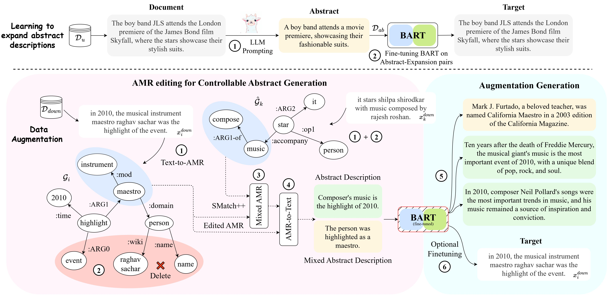

# ABEX
Code for ACL 2024 paper  -- ABEX: Data Augmentation for Low-Resource NLU via Expanding Abstract Descriptions



Our pretrained ABstract-EXpand model has been uploaded on HuggingFace: [utkarsh4430/ABEX-abstract-expand](https://huggingface.co/utkarsh4430/ABEX-abstract-expand).
Use the following code to generate expansions from abstract texts.

```python
from transformers import pipeline, AutoTokenizer
tokenizer = AutoTokenizer.from_pretrained('utkarsh4430/ABEX-abstract-expand')
model_pipeline = pipeline("text2text-generation", model='utkarsh4430/ABEX-abstract-expand', tokenizer=tokenizer)

input_text = 'A chance to meet WWE stars and support a good cause.'

for f in range(5):
    generated_text = model_pipeline(input_text, num_beams=1, top_k=100, do_sample=True, max_length=350, num_return_sequences=1)
    print(f'Aug {f}: ', generated_text[0]['generated_text'])
```

Example Output:
```
Aug 0:  WWE stars to visit Detroit on January 20th for the second time in three years, with appearances at The Battle at the Fox Sports 1 World Headquarters, and proceeds going to a charity of your choice.
Aug 1:  A one-on-one experience at the WWE Creative Conference in New Jersey was provided, with an opportunity for the audience to meet WWE superstars and support a good cause.
Aug 2:  Sindrun welcomes WWE star Chris Jericho and hosts an event for attendees to meet WWE stars and support a local cause.
Aug 3:  Find out if you can meet WWE stars, including the Rock and Shake, at a benefit luncheon.
Aug 4:  The WWE Talent Showcase 2019 will feature exciting moments inside the WWE Studios, including the first one in over a decade, and features a chance to hug current and former stars and receive a check from a corporate sponsor.
```

### Steps to generate data augmentations from ABEX

1. Install dependencies using:
```
pip install -r requirements.txt
```

2. Setup GitHub repository [AMR-DA: Data Augmentation by Abstract Meaning Representation](https://github.com/zzshou/amr-data-augmentation) for Text to AMR and AMR to Text pipelines

3. Take sample data from [test_data](./test_data) and use the Spring AMR Parser to convert it to AMR

4. Run our AMR filtering pipeline:
```
python src/filter_amr.py
```

5. Convert the filtered AMRs back to text using plms-graph2text AMR generator

6. Use [autoregressive_generate](./src/autoregressive_generate.py) to expand the edited abstract texts


Citation:

```
@inproceedings{
    ghosh2024abex,
    title={{ABEX}: Data Augmentation for Low-Resource {NLU} via Expanding Abstract Descriptions},
    author={Sreyan Ghosh and Utkarsh Tyagi and Sonal Kumar and Chandra Kiran Reddy Evuru and and Ramaneswaran S and S Sakshi and Dinesh Manocha},
    booktitle={The 62nd Annual Meeting of the Association for Computational Linguistics},
    year={2024},
}
```
